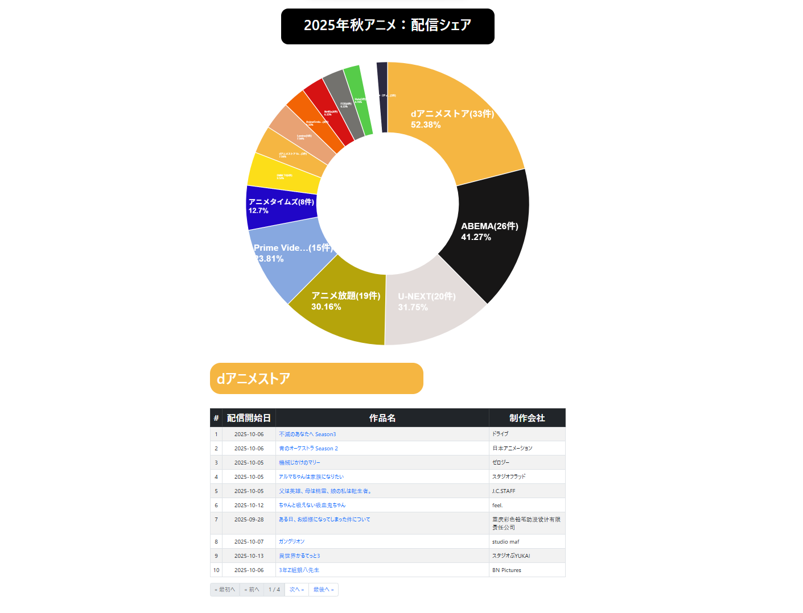
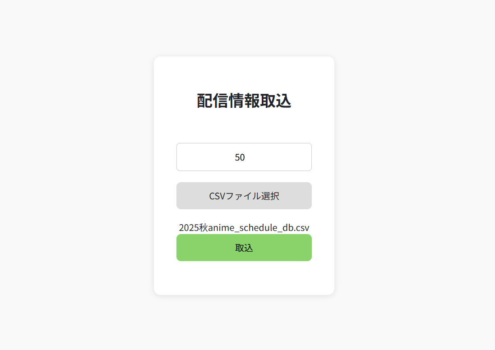
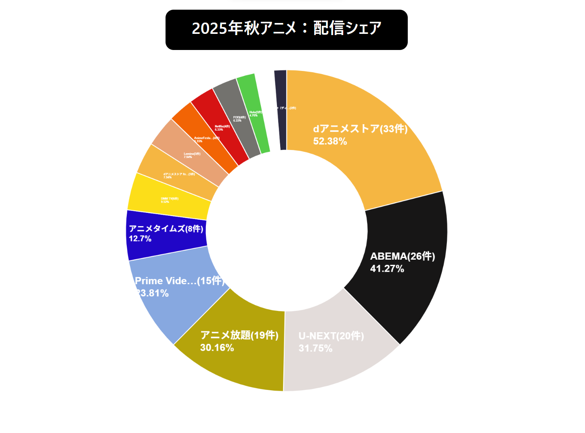
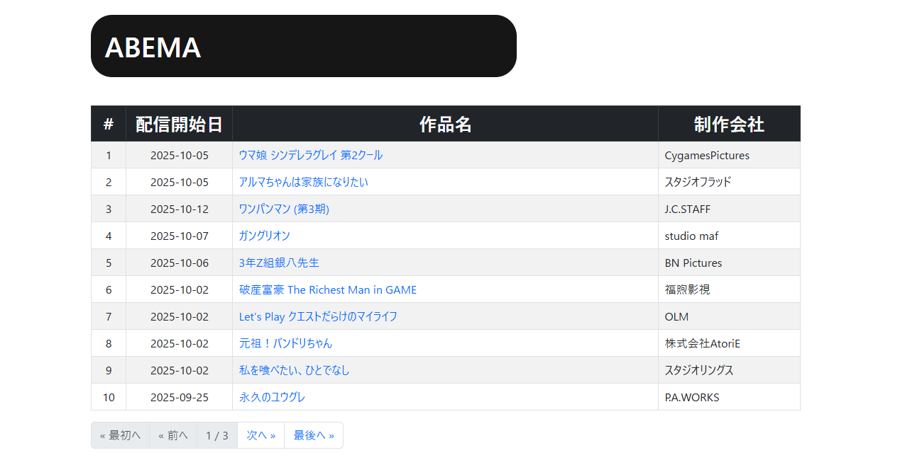

# 📊 **PlatformRateGraph_app**

## **今期アニメの配信シェアを分析する可視化アプリ**

**配信アニメを最も多く扱うサブスクを自動分析し、見やすいグラフと一覧で表示する Django アプリです。**

📊 CSV取込 → 🎨 円グラフ表示 → 📋 ページネーション一覧 → 🔎 作品詳細へジャンプ

---

# 🖼️ 画面イメージ
### ▼アプリ全体画面（Django）


### ▼配信情報取込


### ▼グラフ画面（Chart.js）


### ▼配信情報一覧（Django）



---

# 🚀 プログラムの概要
本アプリケーションは、今期配信アニメを一番網羅しているサブスクリプションを円グラフで可視化します。
また、各サブスクリプションで配信されているアニメの配信情報の一覧表示（配信開始日／作品名／制作会社）公式URLへのリンクジャンプ／ページネーションでのページを切り替えが可能です。
※現時点では今現在のクールのみ表示可能です。

データの入力・管理・可視化を行う機能を備え、作業効率化と操作性を重視して設計しています。

---

# 🤖 創作物コンセプト
> 以前に最速アニメの配信情報をスクレイピングで取得しNotionのDBを新規作成→データを登録するスクリプトを開発しました。（AniTime_app）
その開発過程で抽出したデータを活かし自身のアニメ視聴環境を最適化できないかと考え、今回のアプリを開発しました。

---


# 🧩 主な機能
### 配信情報 取込画面（intake_info）
- 📥 CSVアップロード
- ✔  ボタンの活性・非活性制御
- 🔍 配信件数の妥当性チェック
- 📝 入力フォームでの登録
- 🔍 Django メッセージフレームワークによる動的フィードバック


### 配信シェア画面 （rate_graph）
- 📊 Chart.js を用いた円グラフでのデータ可視化
- 🎪 クリックイベントでの配信情報一覧表示
- ✔  Ajaxを使ったページネーション制御
- 📝 cssアニメーションを用いた制御


---
# ⚙ アプリの動かし方（セットアップ手順）
以下は本プロジェクトをローカル環境で動かすための手順です。

## 🧱 1. リポジトリのクローン
```
git clone https://github.com/hiromuaraki/PlatformRateGraph_app.git

cd PlatformRateGraph_app
```

## 🐍 2. 仮想環境の作成 & 有効化
もし**Pythonをまだダウンロードしていない場合は**、
先に`https://www.python.org/downloads/`よりダウンロードをお願いします。ダウンロード済みの場合は次の手順へ進んでください。

補足：
ここからのコマンド操作ですが Windowsは`python`, masOSは`python3`になります。基本WindowsOSをベースにして進めます。
基本的に末尾に`3`が有無の違いしかありませんが、一部のケースでmasOSコマンドも載せています。


```
python -m venv venv
venv\Scripts\activate
```

### macOS/Linux
```
source venv/bin/activate
```

## 📦 3. 必要パッケージのインストール
```
pip install -r requirements.txt
```

## 🗄 4. データベースのマイグレーション
```
python manage.py migrate
```

## 📥 5 .初期データの投入
```
python manage.py loaddata data/initial_data.json
```

## ▶ 6. サーバ起動

```
python manage.py runserver
```
ブラウザで`http://127.0.0.1:8000/rate_graph/`
へアクセス

# 💻 使用技術

## 🗣 言語
- Python 3.13.5
- JavaScript
- HTML / CSS

## 🧭 フレームワーク
- Django

## 🗄️ DB
- SQLite3（開発）

## 🛠 開発環境
- OS: Windows10
- IDE: Visual Studio Code  

## 📦 外部ライブラリ・ツール
- Chart.js
- Bootstrap 5（※一部 UI のみ）
- Django メッセージフレームワーク
- Python 標準ライブラリ（csv, defaultdict, datetime 他）

---

# 🏗️ アーキテクチャ構成
- Django MVC（MTV）パターン
- `views.py`: 取込処理、グラフ表示
- `xxx_service.py`: ビジネスロジック、データアクセス処理を集約
- `form_control.js`: フォームコントロールの制御
- `pie_chart.js`: 円グラフのデータを設定＋ページネーション（Ajax対応）の制御
- `utils.py`: よく使う月日に関連する処理を集約
- `models.py`: 配信情報モデル（プラットフォーム／作品／配信日）
- `template/`: Chart.js / Djangoメッセージ等のUI処理
- `static/`: カスタムCSS、アニメーション、JSイベントハンドラ